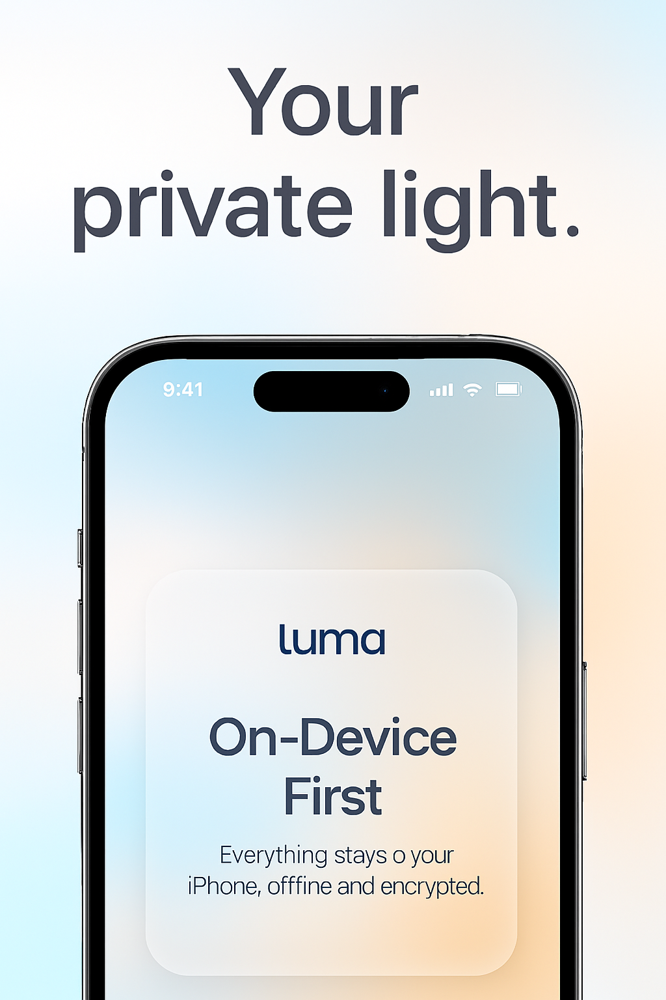
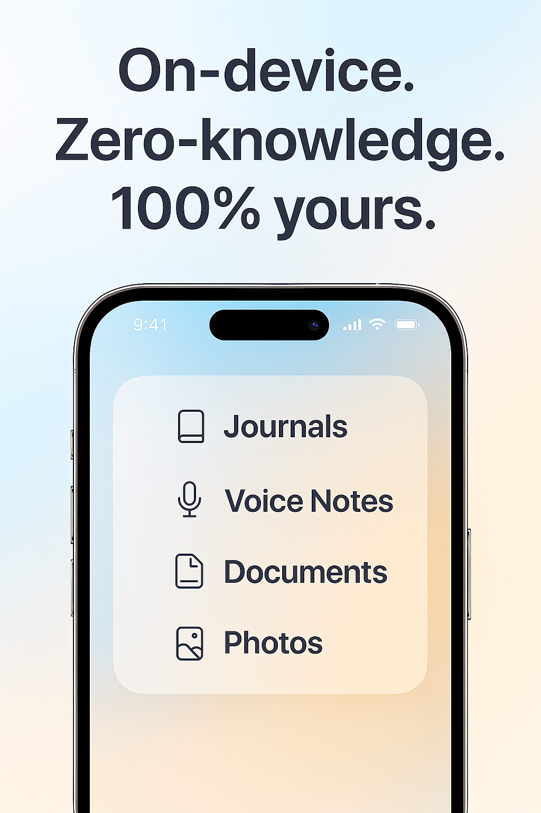
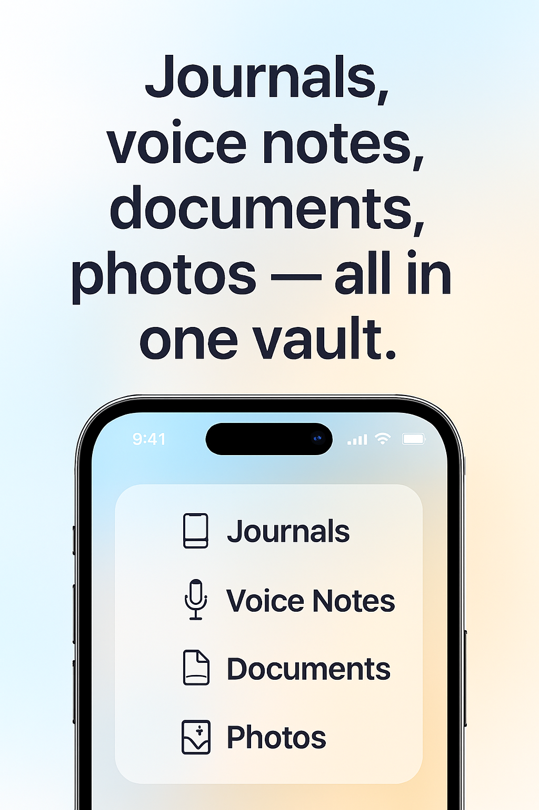
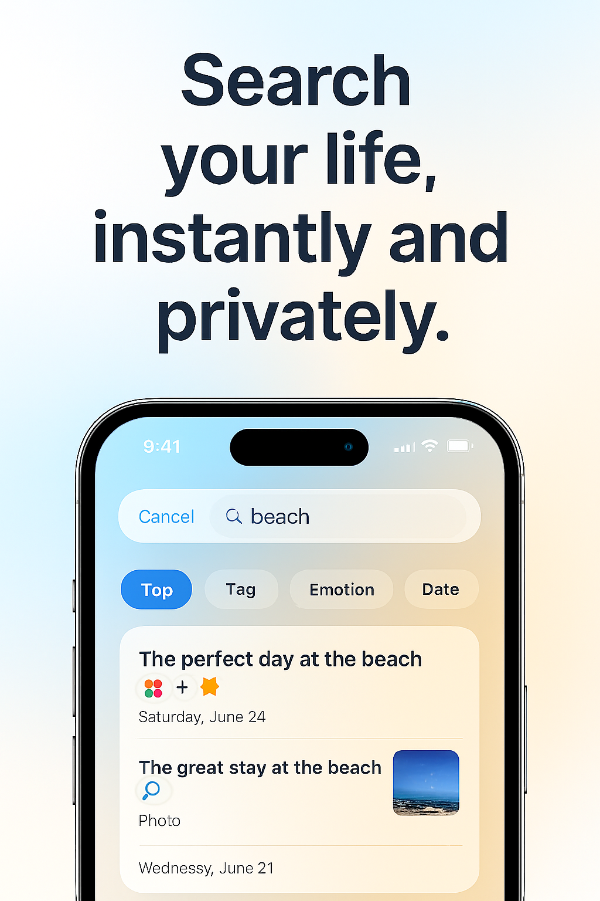

<div align="center">

# 🔐 Whisper Journal

### Privacy-First Personal Vault with Zero-Knowledge Encryption

*Your thoughts, memories, and files — completely private, beautifully designed.*

[](https://flutter.dev)
[](https://www.apple.com/ios)
[](https://www.android.com)
[](LICENSE)

[Features](#-features) • [Screenshots](#-screenshots) • [Architecture](#-architecture) • [Getting Started](#-getting-started) • [Documentation](#-documentation)

</div>

---

## 📱 Screenshots

<div align="center">




</div>

---

## ✨ Features

### 🔒 **Zero-Knowledge Security**
- **AES-256-GCM Encryption** — Military-grade encryption for all your data
- **PBKDF2 Key Derivation** — 100,000 iterations for maximum security
- **Secure Enclave Integration** — Hardware-backed key storage on iOS
- **Biometric Authentication** — Face ID / Touch ID with passphrase fallback
- **100% Offline** — No servers, no tracking, no compromises

### 📝 **Content Types**
- **Journal Entries** — Write your thoughts with rich text support
- **Documents** — Import and encrypt PDFs, TXT, DOC/DOCX files
- **Photos** — Secure photo storage from camera or gallery
- **Voice Notes** ⚠️ — Coming soon (see [roadmap](#-roadmap))

### 🎨 **iOS 26-Inspired Design**
- **Glassmorphism UI** — Blurred translucent panels with depth
- **SF Pro Typography** — Large, editorial type for superior readability
- **Generous White Space** — Magazine-style layouts
- **Smooth Animations** — Apple-native transitions and micro-interactions
- **Haptic Feedback** — Tactile responses for every interaction
- **Accessibility** — Dynamic Type and VoiceOver support

### 🔍 **Powerful Search**
- **Spotlight-like Experience** — Instant local search across all entries
- **Smart Filters** — Filter by type, tags, date, or emotion
- **Encrypted Indexing** — Fast search without compromising security
- **Fuzzy Matching** — Find entries even with typos

### 🏗️ **Clean Architecture**
- **Repository Pattern** — Separation of concerns for maintainability
- **Riverpod State Management** — Reactive, testable state handling
- **Immutable Data Models** — Thread-safe, predictable state
- **Drift Database** — Fast, reliable local storage with compile-time safety

---

## 🏛️ Architecture

### Layered Architecture

```
┌─────────────────────────────────────────────┐
│         Presentation Layer                  │
│  (Screens, Widgets, Riverpod Providers)     │
├─────────────────────────────────────────────┤
│         Domain Layer                        │
│  (Entities, Repository Interfaces)          │
├─────────────────────────────────────────────┤
│         Data Layer                          │
│  (Drift DB, Services, Repository Impl)      │
└─────────────────────────────────────────────┘
```

### Project Structure

```
lib/
├── core/                      # Shared utilities & theme
│   ├── theme/                # Design system
│   │   ├── app_colors.dart   # Color palette
│   │   ├── app_typography.dart # Typography scale
│   │   ├── app_spacing.dart  # Spacing system
│   │   └── app_theme.dart    # Theme configuration
│   └── widgets/              # Reusable components
│       ├── glass_card.dart   # Glassmorphic card
│       ├── primary_button.dart
│       └── secondary_button.dart
│
├── domain/                    # Business logic
│   ├── entities/             # Core data models
│   │   ├── vault_entry.dart  # Entry entity
│   │   └── entry_type.dart   # Entry types enum
│   └── repositories/         # Repository contracts
│       ├── vault_repository.dart
│       └── biometric_repository.dart
│
├── data/                      # Data management
│   ├── database/             # Local database
│   │   └── app_database.dart # Drift schema
│   ├── services/             # Core services
│   │   ├── encryption_service.dart    # AES-256-GCM
│   │   ├── biometric_service.dart     # Face ID/Touch ID
│   │   ├── file_import_service.dart   # Document import
│   │   └── voice_recording_service.dart # Audio (stub)
│   └── repositories/         # Repository implementations
│       └── vault_repository_impl.dart
│
└── presentation/             # UI layer
    ├── providers/            # Riverpod providers
    │   └── vault_providers.dart
    └── screens/              # App screens
        ├── onboarding/       # Welcome flow
        ├── vault_unlock/     # Authentication
        ├── home/             # Main dashboard
        ├── entry_detail/     # Entry editor
        └── search/           # Search interface
```

---

## 🚀 Getting Started

### Prerequisites

- **Flutter SDK** 3.0.0 or higher
- **Xcode** 14.0+ (for iOS)
- **Android Studio** (for Android)
- **CocoaPods** (for iOS dependencies)

### Installation

```bash
# Clone the repository
git clone https://github.com/tahsinmert/luma-app.git
cd luma-app

# Install dependencies
flutter pub get

# Generate database code
dart run build_runner build --delete-conflicting-outputs

# Run the app
flutter run
```

### Platform Setup

#### iOS
```bash
cd ios
pod install
cd ..
flutter run -d "iPhone 15 Pro"
```

#### Android
```bash
flutter run -d <android-device-id>
```

---

## 🎯 Usage

### Creating Your Vault

1. **Onboarding** — Learn about privacy-first design
2. **Create Vault** — Set a strong passphrase
3. **Biometric Setup** — Enable Face ID/Touch ID (automatic)

### Adding Entries

```dart
// Journal Entry
Home → New Entry → Journal Entry
Title: "My Thoughts"
Content: "Today was amazing..."
Tags: personal, daily
→ Save

// Document Import
Home → New Entry → Document
→ Select PDF file
→ Automatically encrypted and stored

// Photo Import
Home → New Entry → Photo
→ Camera or Gallery
→ Encrypted and saved
```

### Searching

```
Home → Search 🔍
Type: "vacation"
Filter: Photos
→ All vacation photos displayed
```

---

## 🔐 Security Architecture

### Encryption Flow

```
┌──────────────┐
│ User Input   │
│ (Passphrase) │
└──────┬───────┘
       │
       ▼
┌──────────────┐
│   PBKDF2     │ 100,000 iterations
│ Key Derivation│
└──────┬───────┘
       │
       ▼
┌──────────────┐
│ AES-256-GCM  │
│  Encryption  │
└──────┬───────┘
       │
       ▼
┌──────────────┐
│ Drift DB     │
│ (Encrypted)  │
└──────────────┘
```

### Key Features

- **Zero-Knowledge**: Keys never leave your device
- **Hardware-Backed**: Secure Enclave on iOS, AndroidKeyStore on Android
- **Passphrase Protection**: PBKDF2 with high iteration count
- **Encrypted at Rest**: All data encrypted before storage
- **No Telemetry**: Zero analytics or tracking

---

## 🛠️ Tech Stack

| Category | Technology |
|----------|-----------|
| **Framework** | Flutter 3.0+ |
| **State Management** | Riverpod 2.4+ |
| **Local Database** | Drift (SQLite) |
| **Encryption** | cryptography, encrypt |
| **Biometrics** | local_auth, flutter_secure_storage |
| **File Handling** | file_picker, image_picker |
| **Design System** | Custom glassmorphism components |

---

## 📋 Roadmap

### ✅ Completed
- [x] Core vault functionality
- [x] Biometric authentication (Face ID/Touch ID)
- [x] Journal entries with encryption
- [x] Document/PDF import and encryption
- [x] Photo import from camera/gallery
- [x] Local search with smart filters
- [x] Tag system
- [x] iOS 26-inspired UI
- [x] Glassmorphism design system
- [x] Haptic feedback

### 🚧 In Progress
- [ ] Voice note recording ([see implementation guide](VOICE_RECORDING_TODO.md))
- [ ] Audio playback widget
- [ ] On-device transcription

### 🔮 Planned
- [ ] Encrypted backup/export
- [ ] WebDAV sync (optional)
- [ ] Emotion tracking with insights
- [ ] Full-text search (FTS5 optimization)
- [ ] Multiple vaults support
- [ ] Light mode theme
- [ ] iPad optimization
- [ ] Apple Watch companion app
- [ ] Widget support

---

## 📖 Documentation

- **[Setup Guide](SETUP.md)** — Detailed installation and configuration
- **[Examples](EXAMPLES.md)** — Code examples and usage patterns
- **[Voice Recording TODO](VOICE_RECORDING_TODO.md)** — Implementation guide

---

## 🤝 Contributing

Contributions are welcome! Please follow these guidelines:

1. Fork the repository
2. Create a feature branch (`git checkout -b feature/amazing-feature`)
3. Commit your changes (`git commit -m 'Add amazing feature'`)
4. Push to the branch (`git push origin feature/amazing-feature`)
5. Open a Pull Request

### Development Guidelines

- Follow Flutter/Dart style guide
- Write tests for new features
- Update documentation
- Ensure all tests pass before submitting

---

## 📄 License

This project is licensed under the MIT License - see the [LICENSE](LICENSE) file for details.

---

## 🔒 Privacy Policy

**Whisper Journal** is built with privacy as the core principle:

- ❌ **No Data Collection** — We don't collect any data
- ❌ **No Analytics** — Zero tracking or telemetry
- ❌ **No Cloud Storage** — Everything stays on your device
- ❌ **No Third-Party Services** — Completely isolated
- ✅ **Open Source** — Transparent and auditable

---

## 💬 Support

- **Issues**: [GitHub Issues](https://github.com/tahsinmert/luma-app/issues)
- **Discussions**: [GitHub Discussions](https://github.com/tahsinmert/luma-app/discussions)
- **Email**: tahsinmert2005@icloud.com

---

## 🙏 Acknowledgments

- **Flutter Team** — For the amazing framework
- **Drift Team** — For the excellent database solution
- **Riverpod Community** — For state management guidance
- **iOS Design Team** — For design inspiration

---

<div align="center">

### Built with ❤️ for privacy-conscious individuals

**[⬆ Back to Top](#-whisper-journal)**

</div>